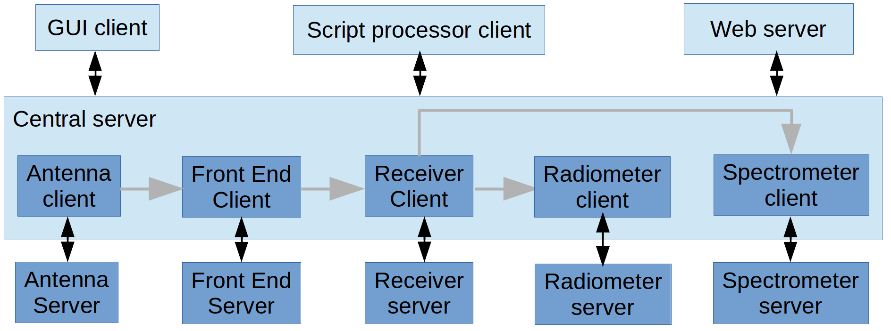

.. MonitorControl documentation master file, created by
   sphinx-quickstart on Mon Aug  3 13:38:44 2020.
   You can adapt this file completely to your liking, but it should at least
   contain the root `toctree` directive.

Single Dish Radio Astronomy Software Tools
==========================================

For an overview of SDRAST and the current status please visit https://sdrast.github.io/.

General Purpose Radio Telescope Monitor and Control
===================================================

This is a collection of Python packages for using any fully sterable antenna and
receiver as a radio telescope. The requirement is that the all the systems have
their own controllers which can be operated with through a Python server using a
standard communication protocol (*e.g.* sockets, USB, IEEE-488, RS-232, SNMP,
*etc.*). The base package submodules provide superclasses for clients of these 
servers.

It is possible to use an existing monitor and control system as the server, as
long as there is a way for it to accept commands and send responses using a
standard protocol. In this case, the ``MonitorControl`` server which provides 
the gateway needs to be organized as a set of system servers using the same
interface. 

In this diagram, each client has a subclass which is specific to the server to
which it interfaces. The client subclasses which used for a particular observing
session are defined in a Python function called ``configuration()``.  There
can be any number of configurations identified by a string ``context``.
Communication between clients and their servers uses the ``Pyro5`` module.

The central server keeps track of what happens to a signal as it enters the
telescope (antenna) and progresses to its final digital format for analysis.
To achieve this there are three base superclasses.

.. image:: baseClasses.png
   :width: 300
   
Each of the clients in the previous figure is a subclass of ``Device`` which
operates on one or more ``Signal``\ objects that enter and leave *via*
``Port`` objects.

Operation
---------
The central client works at the command line, using simulators for the antenna,
receiver front end, and signal processing backend. ``True`` means that client
is communicating with (simulated) hardware.::

  In [1]: from MonitorControl.dss_server import DSSServer

  In [2]: cs = DSSServer('WBDC2_K2',
                          config_args={'hardware': {'Antenna':True, 
                                                    'FrontEnd':True, 
                                                    'Backend':True}}, 
                    boresight_manager_kwargs=dict(reload=False, dump_cache=False))

  In [3]: for device in cs.equipment.keys(): 
              print(device, "is", cs.equipment[device]) 
                                                                                                                                                      
  Antenna is DSN_Antenna "DSS-43"
  FE_selector is None
  FrontEnd is K_4ch "K"
  Rx_selector is None
  Receiver is WBDC2 "WBDC-2"
  IF_switch is IFswitch "Patch Panel"
  Backend is SAOclient "SAO spectrometer"
  sampling_clock is None

  In [4]: cs.equipment['Backend'].roachnames
  Out[4]: ['roach1', 'roach2', 'roach3', 'roach4']

  In [5]: cs.equipment['FrontEnd'].read_PMs()
  Out[5]: 
    [(1, 3.3588105790590205e-08),
     (2, 4.000051946785503e-08),
     (3, 5.2318605854014335e-08),
     (4, 4.906179322988035e-08)]

  In [6]: cs.equipment['FrontEnd'].feed_states()                
  Out[6]: (False, True)

  In [7]: cs.equipment['FrontEnd'].set_ND_on()

  In [8]: cs.equipment['FrontEnd'].read_PMs()
  Out[8]: 
    [(1, 7.344903928672483e-08),
     (2, 8.764367036205836e-08),
     (3, 1.1014350435767278e-07),
     (4, 1.0521970259070695e-07)]
 
  In [9]: cs.equipment['Backend'].hardware
  Out[9]: <Pyro5.client.Proxy at 0x7fe5e5576e50; connected IPv6;
           for PYRO:backend@localhost:50004;
           owner <greenlet.greenlet object at 0x7fe5f40e8cb0>>

Clients are being developed for a GUI using Qt5.  A web-based client using
Flask and Flask Socket IO are also being developed.

Base Class Modules
==================
These modules are all part of the base ``MonitorControl`` package.

.. automodapi:: MonitorControl
.. automodapi:: MonitorControl.Antenna
.. automodapi:: MonitorControl.FrontEnds
.. automodapi:: MonitorControl.Receivers
.. automodapi:: MonitorControl.BackEnds
.. automodapi:: MonitorControl.Configurations

Context Modules
===============
Antenna
-------
.. automodapi:: MonitorControl.Antenna.DSN
.. automodapi:: MonitorControl.Antenna.DSN.simulator

Front Ends
----------
.. automodapi:: MonitorControl.FrontEnds.DSN
.. automodapi:: MonitorControl.FrontEnds.K_band

Receivers
---------
.. automodapi:: MonitorControl.Receivers.DSN
.. automodapi:: MonitorControl.Receivers.WBDC

Back Ends
---------
.. automodapi:: MonitorControl.BackEnds.DSN
.. automodapi:: MonitorControl.BackEnds.ROACH1
.. automodapi:: MonitorControl.BackEnds.ROACH1.SAOclient
.. automodapi:: MonitorControl.BackEnds.ROACH1.simulator

Configurations
--------------
.. automodapi:: MonitorControl.Configurations.CDSCC
.. automodapi:: MonitorControl.Configurations.GDSCC

.. toctree::
   :maxdepth: 2
   :caption: Contents:

Indices and tables
==================

* :ref:`genindex`
* :ref:`modindex`
* :ref:`search`

Last revised by Tom Kuiper 2020 Aug 3.
